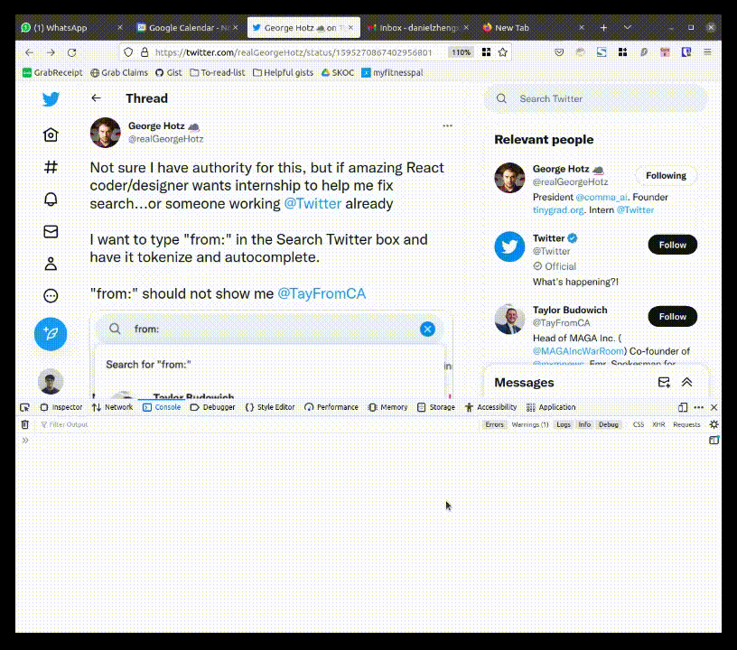

# What is this
 
1. The original call-to-action from [GeorgeHotz](https://twitter.com/realGeorgeHotz)  
 

2. My subsequent entry  
  

# How to use this
1, Copy and past the code from [./script.js](./script.js) into https://twitter.com console.  
2. Type "from:" into search bar and watch and tokenize and autocomplete happens

